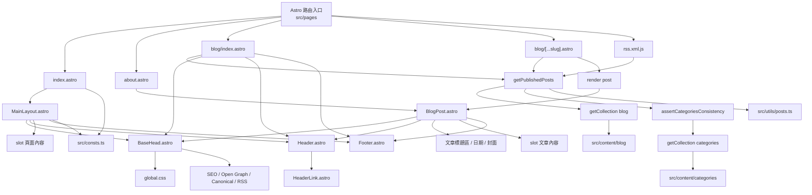

# 頁面佈局架構圖

本文件說明目前 my-blog 專案的頁面佈局分層、路由入口與共用元件關係。

## Mermaid 圖



## ASCII 示意圖

```text
src/pages
|
+-- index.astro
|   |
|   +-- MainLayout.astro
|       |
|       +-- BaseHead.astro
|       |   |
|       |   +-- global.css
|       |   +-- SEO / Open Graph / Canonical / RSS
|       |
|       +-- Header.astro
|       |   |
|       |   +-- HeaderLink.astro
|       |
|       +-- <slot /> 頁面內容
|       |
|       +-- Footer.astro
|       |
|       +-- src/consts.ts
|
+-- about.astro
|   |
|   +-- BlogPost.astro
|       |
|       +-- BaseHead.astro
|       +-- Header.astro
|       +-- 文章標題區 / 日期 / 封面
|       +-- <slot /> 內容
|       +-- Footer.astro
|
+-- blog/index.astro
|   |
|   +-- getPublishedPosts()
|       |
|       +-- src/utils/posts.ts
|           |
|           +-- getCollection('blog')
|           +-- assertCategoriesConsistency()
|           |   |
|           |   +-- getCollection('categories')
|           +-- draft 過濾 / 分類推導 / 排序
|       |
|       +-- BaseHead.astro / Header.astro / 文章列表內容 / Footer.astro
|
+-- blog/[...slug].astro
    |
    +-- getPublishedPosts() + render(post)
        |
        +-- src/utils/posts.ts
        |   |
        |   +-- src/content/blog
        |   +-- src/content/categories
        |
        +-- BlogPost.astro
            |
            +-- BaseHead.astro
            +-- Header.astro
            +-- 文章標題區 / 日期 / 封面
            +-- <slot /> 文章內容
            +-- Footer.astro
```

## 目前頁面分流

### 1. 一般頁面

- `src/pages/index.astro` 使用 `src/layouts/MainLayout.astro`
- `MainLayout.astro` 統一包住 `BaseHead`、`Header`、`Footer` 與中間的 `<slot />`
- 適合首頁、一般內容頁、未來的標籤頁或分類頁

### 2. 文章型頁面

- `src/pages/blog/[...slug].astro` 透過 `src/utils/posts.ts` 的 `getPublishedPosts()` 讀取文章
- 共用資料存取層統一處理 draft 過濾、文章路徑的 category 推導，以及 `categories` metadata 一致性驗證
- 文章內容經過 `render(post)` 後，交給 `src/layouts/BlogPost.astro`
- `BlogPost.astro` 除了共用 head/header/footer 之外，還負責文章封面、日期與內文區塊樣式

### 3. 關於頁

- `src/pages/about.astro` 目前直接使用 `src/layouts/BlogPost.astro`
- 這表示關於頁目前被視為文章型頁面，而不是一般資訊頁

### 4. 文章列表頁

- `src/pages/blog/index.astro` 目前沒有走 `MainLayout.astro` 或 `BlogPost.astro`
- 它透過 `getPublishedPosts()` 取得文章後，再依 `pubDate` 由新到舊排列
- 這個頁面是自己直接引入 `BaseHead`、`Header`、`Footer` 後手動組裝版面
- 因此目前專案的 layout 使用方式並不完全一致

## 共用元件責任

### BaseHead.astro

- 載入全域樣式 `src/styles/global.css`
- 設定 title、description、canonical URL
- 設定 Open Graph、Twitter 與 RSS 等 Metadata
- 在正式環境載入 Google Analytics

### Header.astro

- 提供全站上方導覽列
- 內部使用 `HeaderLink.astro` 處理 active 狀態

### Footer.astro

- 提供全站頁尾與社群連結

### src/utils/posts.ts

- 集中存取 blog collection，供文章列表、文章動態路由與 RSS 使用
- 統一處理 dev／production 的 draft 規則、分類推導、分類一致性驗證與文章排序
- `src/content/blog/<category>/` 的第一層資料夾為分類來源，且必須有對應的 `src/content/categories/<category>.json`

## 架構總結

目前專案以 `src/pages` 作為路由入口，主要有兩種 layout，並以共用資料存取層供所有 blog 相關入口使用：

1. `MainLayout.astro`：一般頁面外框
2. `BlogPost.astro`：文章型頁面外框
3. `src/utils/posts.ts`：文章資料存取、draft 規則與分類一致性驗證

但 `src/pages/blog/index.astro` 仍採用手動組頁方式，因此如果未來要再整理架構，最優先可以考慮將文章列表頁也收斂到共用 layout。
